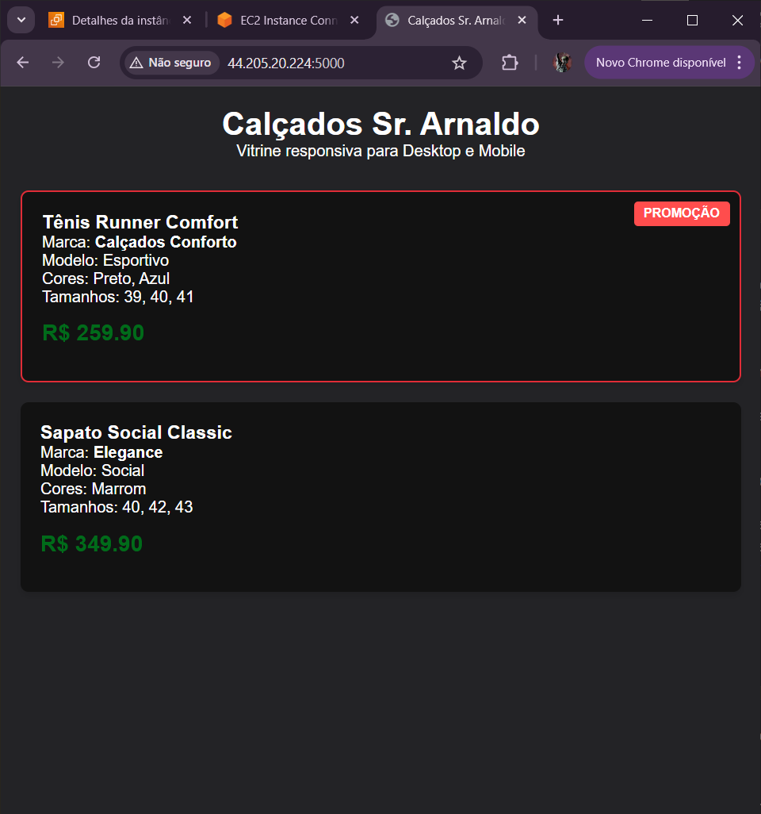

# 👟 E-commerce Sr. Arnaldo - Loja de Sapatos


Aplicação Full-Stack desenvolvida de forma modular e totalmente responsiva (funciona em Desktop e Mobile) para a loja de sapatos do Sr. Arnaldo.

## 🛠️ Arquitetura do Projeto

O projeto é dividido em duas partes independentes:
1. **Back-end:** API REST desenvolvida em **Node.js**, pronta para deploy em ambiente Serverless ou tradicional na **AWS**.
2. **Front-end:** Interface modular construída focando em performance, componentização e responsividade (Mobile-First).


## 📦 Como Visualizar e Executar a API (Back-end)

### 1. Instalação Local
Abra o terminal na pasta raiz do projeto e execute:
```bash
cd backend
npm install